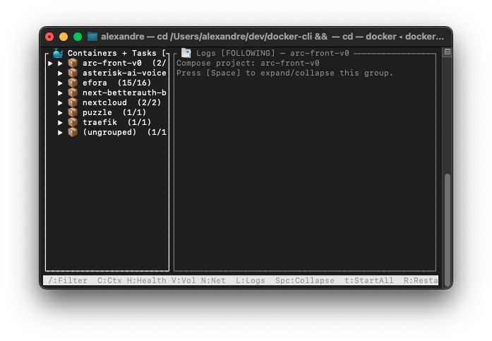
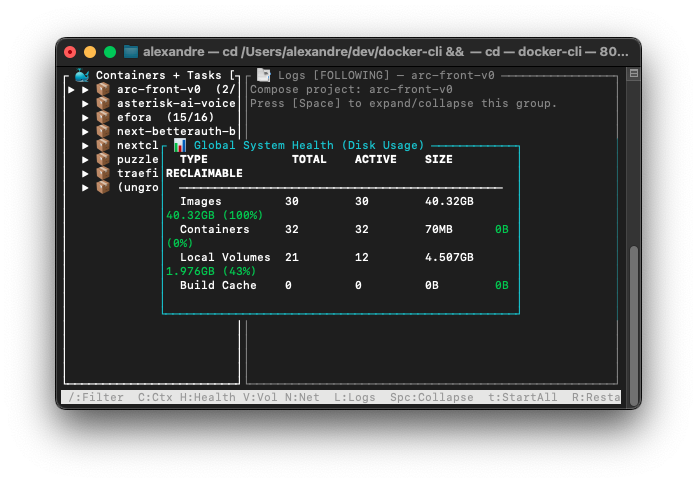
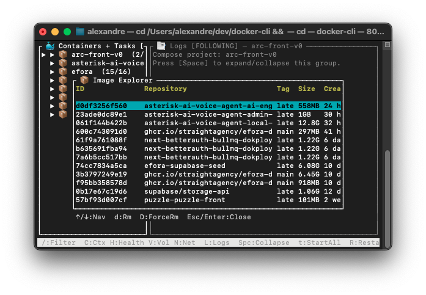
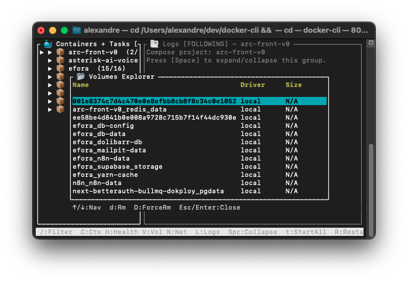

# docker-cli (Rust)

A fast, fluid, and powerful Terminal User Interface (TUI) to manage your Docker containers, Swarm clusters, Compose stacks, and local CLI tasks. Built in Rust with `ratatui` for maximum performance and highly responsive interactions.



<p align="center">
  
  &nbsp;
  
</p>

## ✨ Key Features

### 🏗️ Advanced Architecture Support

- **Project Auto-detection**: Automatically detects project root via `docker-compose.yml` or `package.json`.
- **Swarm Hierarchical Tree**: Visualizes Swarm clusters intuitively (`Service` -> `Tasks` -> `Container` -> `Node`).
- **Multi-context Switcher**: Easily switch between local, colima, and remote Docker contexts via UI (`C`).

<p align="center">
  
</p>

### 🚀 Powerful Management Tools

- **Interactive Resource Explorers**:
  - **📦 Image Explorer (`Shift+I`)**: List, inspect, and remove Docker images.
  - **💾 Volumes Explorer (`Shift+V`)**: Interactive table to manage and delete volumes.
  - **🌐 Networks Explorer (`Shift+N`)**: Interactive table to manage Docker networks.

<p align="center">
  
  &nbsp;
  
</p>

- **Comprehensive Actions**: Start, Stop, Pause, Unpause, Kill, Restart, Remove, Inspect, and Scale Swarm Services directly from the UI.
- **Multi-select (`v`)**: Select multiple containers or services to perform batch actions (e.g., stopping or removing multiple containers at once).

### 📑 Next-Level Logs & Shell

- **Interactive Shell 3.0 (`e`)**: Built-in split-pane terminal with command history, live input buffering, and prompt indicator for a responsive experience even without a full TTY.
- **Compose Aggregate Logs (`L`)**: Stream logs from an entire Compose project in a single unified view.
- **Live Log Filtering (`/`)**: Search and highlight specific keywords in real-time log streams. Essential for debugging large servers.
- **Smart Follow Mode (`f`)**: Toggle auto-scrolling on/off to read historical logs without being interrupted by new lines.

### 🩺 Global Health & Maintenance

- **System Health Dashboard (`H`)**: Overview of disk usage consumed by Images, Containers, and Volumes.
- **Interactive Prune UI**: Safely trigger a system-wide `docker system prune` with an interactive confirmation prompt (`X` from Dashboard).

### 🎨 Premium Ergonomics

- **Rich Interface**: RGB color matching, block-character resource gauges (`░▒▓█`), and Toast notifications for immediate feedback.
- **Pinning (`P`)**: Pin your favorite or most critical containers to the top of the sidebar.
- **Mouse Support**: Click to select items, use the scroll wheel to read logs.

---

## 💻 Installation

To use `docker-cli` as a global command on your machine:

### Option 1: Install via Cargo (Recommended)

If you have Rust installed:

```bash
cargo install --path .
```

This installs the `docker-cli` binary to `~/.cargo/bin`. Ensure this directory is in your `PATH`.
You can then run the command anywhere:

```bash
cd my-project
docker-cli
```

### Option 2: Manual Build and Symlink

If you prefer managing the binary manually:

```bash
# 1. Build release
cargo build --release

# 2. Create a symlink to a PATH directory (e.g., /usr/local/bin)
sudo ln -s $(pwd)/target/release/docker-cli /usr/local/bin/docker-cli
```

---

## ⌨️ Shortcuts & Keybindings

The tool is entirely keyboard-driven (with optional mouse support).

### Global View

| Key            | Action                                                                           |
| -------------- | -------------------------------------------------------------------------------- |
| `Tab`          | Switch focus between the Sidebar (List) and Main Panel (Logs/Shell)              |
| `q` / `Ctrl+C` | Quit the application                                                             |
| `?`            | Show Help menu                                                                   |
| `/`            | Search/Filter the sidebar (when list is focused) or logs (when logs are focused) |
| `Space`        | Expand / Collapse grouped items (Compose stacks, Swarm services)                 |
| `v`            | Select / Deselect item for batch actions (multi-select)                          |
| `f`            | Toggle Follow mode (auto-scroll) for logs                                        |

### Explorers & Dashboards

| Key       | Action                                                  |
| --------- | ------------------------------------------------------- |
| `H`       | **System Health Dashboard** (Disk usage overview)       |
| `X`       | Trigger System Prune (from inside System Health `H`)    |
| `C`       | **Context Switcher** (Switch active Docker socket/host) |
| `Shift+I` | **Image Explorer** (List, inspect, and remove images)   |
| `Shift+V` | **Volumes Explorer**                                    |
| `Shift+N` | **Networks Explorer**                                   |

### Container & Service Actions (Requires Sidebar Focus)

| Key       | Action                                                                          |
| --------- | ------------------------------------------------------------------------------- |
| `e`       | **Interactive Shell**: Open a command shell into the selected container or task |
| `L`       | **Compose Logs**: Show aggregated logs for an entire Compose stack              |
| `t`       | **Start** container / Scale service to 1                                        |
| `s`       | **Stop** container / Scale service to 0                                         |
| `r`       | **Restart** container / Rolling restart for Swarm service                       |
| `R`       | **Restart Compose Project**                                                     |
| `d`       | **Remove** container / service                                                  |
| `x`       | **Reset** container (Stop + Remove + Remove Volumes)                            |
| `S`       | **Scale** Swarm Service (Prompt for replicas)                                   |
| `i`       | **Inspect** (View raw JSON properties in a popup)                               |
| `p` / `u` | **Pause** / **Unpause** container                                               |
| `k`       | **Kill** container                                                              |
| `P`       | **Pin / Unpin** item to the top of the list                                     |
| `o`       | **Open in Browser** (Attempts to find exposed ports)                            |
| `c`       | **Compose Up** (`docker compose up -d`)                                         |

### Logs View Focus

| Key           | Action                                          |
| ------------- | ----------------------------------------------- |
| `m`           | Enter **Copy Mode**                             |
| `y`           | Copy the entire current log buffer to clipboard |
| `PgUp`/`PgDn` | Scroll log history                              |

---

## ⚙️ Configuration (Advanced)

The tool works out-of-the-box, but you can customize it via environment variables (or a `.env` file in the directory where you launch it):

- `DOCKER_BIN` (default: `docker`): Path or alias for the docker executable.
- `DOCKER_PROFILE` / `COMPOSE_PROFILE` (default: `local`): Compose profiles to activate.
- `DB_CONTAINER` (default: `supabase-db`): Specific DB container to track.
- `STORAGE_CONTAINER` (default: `supabase-storage`): Specific storage container to track.
- `MAX_LOG_LINES` (default: `1200`): Log history limits to maintain fast rendering.
- `REFRESH_MS` (default: `1000`): UI refresh interval in milliseconds.
- `POST_UP_TASKS_<PROFILE>`: Additional manual tasks (format: `name::command` per line).
